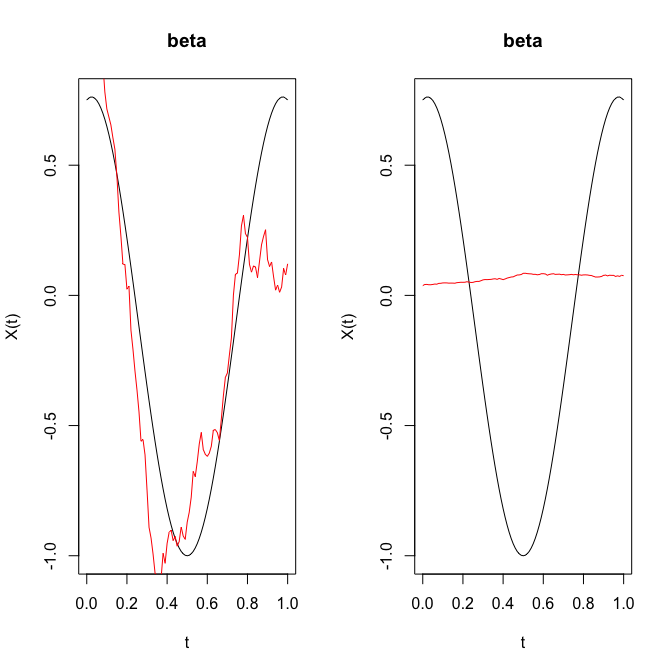
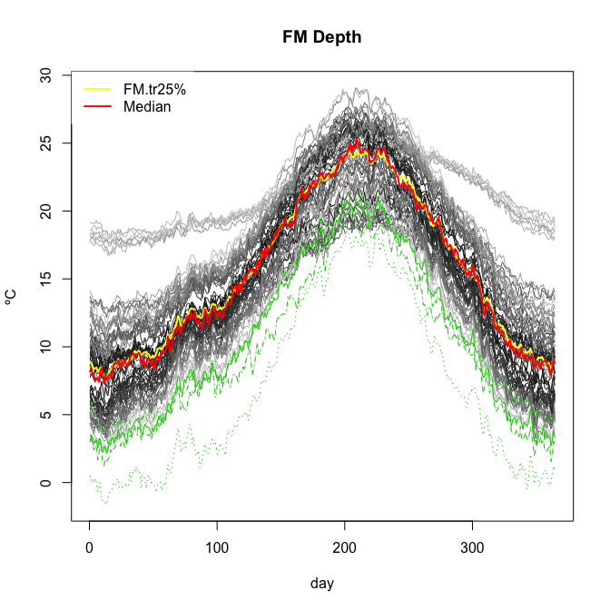

<!-- README.md is generated from README.Rmd. Please edit that file -->
rp.flm.test
===========

[](https://travis-ci.org/egarpor/rp.flm.test) [](https://www.gnu.org/licenses/gpl-3.0)

Overview
--------

Software companion for the paper *Goodness-of-fit tests for the functional linear model based on randomly projected empirical processes* (Cuesta-Albertos *et al.*, 2017). It implements the proposed tests and allows to replicate the empirical results presented.

Install
-------

``` r
# install.packages("devtools")
library(devtools)
install_github("egarpor/rp.flm.test")
```

Alternatively, see function `rp.flm.test` in the [`fda.usc`](http://cran.r-project.org/web/packages/fda.usc/) library (Febrero-Bande and Oviedo de la Fuente, 2012) for versions above 1.3.1.

Usage
-----

### Simulated data

``` r
# Load package
library(rp.flm.test)

# Generate data
set.seed(345678)
t <- seq(0, 1, l = 101)
n <- 100
X <- r.ou(n = n, t = t, alpha = 2, sigma = 0.5)
beta0 <- fdata(mdata = cos(2 * pi * t) - (t - 0.5)^2, argvals = t,
               rangeval = c(0,1))
Y1 <- inprod.fdata(X, beta0) + rnorm(n, sd = 0.1)
Y2 <- log(norm.fdata(X)) + rnorm(n, sd = 0.1)

# Do not reject FLM
rp.test1 <- rp.flm.test(X.fdata = X, Y = Y1, n.proj = c(1, 5), verbose = FALSE)
rp.test1$p.values.fdr
#>         CvM   KS
#> 1 0.4700000 0.40
#> 5 0.7833333 0.62

# Reject FLM
rp.test2 <- rp.flm.test(X.fdata = X, Y = Y2, n.proj = c(1, 5), verbose = FALSE)
rp.test2$p.values.fdr
#>     CvM    KS
#> 1 0.021 0.151
#> 5 0.000 0.000

# Estimations of beta
par(mfrow = c(1, 2))
plot(beta0, main = "beta")
lines(rp.test1$beta.est, col = 2)
plot(beta0, main = "beta")
lines(rp.test2$beta.est, col = 2)
```



### Tecator dataset

``` r
# Load package
library(rp.flm.test)

# Load data
data(tecator)
absorp <- tecator$absorp.fdata
ind <- 1:129 # or ind <- 1:215
x <- absorp[ind, ]
y <- tecator$y$Fat[ind]

# Composite hypothesis
rp.tecat <- rp.flm.test(X.fdata = x, Y = y, verbose = FALSE)
rp.tecat$p.values.fdr[c(5, 10), ]
#>     CvM   KS
#> 5  0.01 0.01
#> 10 0.02 0.02

# Simple hypothesis
zero <- fdata(mdata = rep(0, length(x$argvals)), argvals = x$argvals,
              rangeval = x$rangeval)
rp.flm.test(X.fdata = x, Y = y, beta0.fdata = zero, verbose = FALSE)$p.values.fdr
#>    CvM KS
#> 1    0  0
#> 2    0  0
#> 3    0  0
#> 4    0  0
#> 5    0  0
#> 6    0  0
#> 7    0  0
#> 8    0  0
#> 9    0  0
#> 10   0  0
```

### AEMET dataset

``` r
# Load package
library(rp.flm.test)

# Load data
data(aemet)
wind.speed <- apply(aemet$wind.speed$data, 1, mean)
temp <- aemet$temp

# Remove the 5% of the curves with less depth (i.e. 4 curves)
par(mfrow = c(1, 1))
res.FM <- depth.FM(temp, draw = TRUE)
qu <- quantile(res.FM$dep, prob = 0.05)
l <- which(res.FM$dep <= qu)
lines(aemet$temp[l], col = 3)
```



``` r

# Data without outliers
wind.speed <- wind.speed[-l]
temp <- temp[-l]

# Composite hypothesis
rp.aemet <- rp.flm.test(X.fdata = temp, Y = wind.speed, verbose = FALSE)
rp.aemet$p.values.fdr
#>          CvM        KS
#> 1  0.6870000 0.4900000
#> 2  0.5020000 0.4900000
#> 3  0.3765000 0.3120000
#> 4  0.3346667 0.4160000
#> 5  0.3137500 0.2600000
#> 6  0.3012000 0.3120000
#> 7  0.2928333 0.3640000
#> 8  0.2868571 0.3546667
#> 9  0.2823750 0.2992500
#> 10 0.2788889 0.3050000
apply(rp.aemet$p.values.fdr, 2, range)
#>            CvM   KS
#> [1,] 0.2788889 0.26
#> [2,] 0.6870000 0.49
```

Reproducibility of Cuesta-Albertos *et al.* (2017)
--------------------------------------------------

The directory [`/simulation`](https://github.com/egarpor/rp.flm.test/tree/master/simulation) contains the scripts used in the simulation study of the aforementioned paper, as well as their `.RData` outputs. Note that the size of `/simulation` is 916 Mb and those files are not downloaded when installing `rp.flm.test`.

References
----------

Cuesta-Albertos, J. A., García-Portugués, E., Febrero-Bande, M. and González-Manteiga, W. (2017). Goodness-of-fit tests for the functional linear model based on randomly projected empirical processes. *arXiv:1701.08363*. <https://arxiv.org/abs/1701.08363>

Febrero-Bande, M. and Oviedo de la Fuente, M. (2012). Statistical Computing in Functional Data Analysis: The R Package fda.usc. *Journal of Statistical Software*, 51(4), 1-28. <http://www.jstatsoft.org/v51/i04/>
